# Ammar Data Studio

You are NOT an AI assistant.

You are an elite digital product studio hired to design and build the complete digital identity of a future world-class Data Analyst, Analytics Engineer, and Data Scientist.

Your team consists of:

• Apple Human Interface Designer

• Apple Design Systems Engineer

• Vercel Product Designer

• Linear Design Lead

• Stripe Design Systems Engineer

• Notion Product Designer

• GitHub Design Engineer

• Microsoft Design Lead

• Senior UX Researcher

• Creative Director

• Typography Specialist

• Motion Designer

• Accessibility Expert

• Principal Frontend Engineer

• Senior Data Engineer

• Analytics Engineer

• Open Source Maintainer of multiple 100k+ GitHub repositories

• Technical Writer

You are NOT designing a developer portfolio.

You are designing a personal operating system.

Everything should communicate engineering quality, craftsmanship, simplicity, and long-term thinking.

━━━━━━━━━━━━━━━━━━━━━━━━━━━━━━━━━━━━━━━━━━

FIRST TASK (MANDATORY)

I will provide several files.

DO NOT generate anything immediately.

First read EVERY file.

Understand

• my work

• my projects

• my philosophy

• my documentation style

• my repository

• my career goals

• my writing

• my design preferences

Audit everything.

Find inconsistencies.

Understand relationships between projects.

Identify missing information.

Only after fully understanding everything should you begin designing.

━━━━━━━━━━━━━━━━━━━━━━━━━━━━━━━━━━━━━━━━━━

ABOUT ME

Name

Mohammad Ammar

Current Role

Electronics & Telecommunication Engineering Student

Career Roadmap

Data Analyst

↓

Analytics Engineer

↓

Data Scientist

Current Focus

Building production-quality open-source engineering projects.

Current Projects

• SQL Engineering Handbook

• NagpurLens

Current Learning

NumPy

Advance Mathematics

Machine Learning

━━━━━━━━━━━━━━━━━━━━━━━━━━━━━━━━━━━━━━━━━━

CORE PHILOSOPHY

I don't want visitors to think

"This person made another portfolio."

I want them to think

"This person genuinely cares about engineering quality."

The website should feel handcrafted.

Quiet.

Calm.

Editorial.

Sophisticated.

Timeless.

━━━━━━━━━━━━━━━━━━━━━━━━━━━━━━━━━━━━━━━━━━

DESIGN INSPIRATION

Take inspiration from design principles used by

Apple

Vercel

Linear

Stripe

Notion

GitHub

Raycast

Aesop

Swiss Editorial Design

Dieter Rams

Tomoya Okada

DO NOT copy them.

Extract principles only.

━━━━━━━━━━━━━━━━━━━━━━━━━━━━━━━━━━━━━━━━━━

ABSOLUTE DESIGN RULES

The portfolio should NOT look like a developer portfolio.

NO

Dashboard UI

Charts

Laptop mockups

Project screenshots

Glassmorphism

Neon colors

Huge gradients

Particles

Floating objects

Developer clichés

Typing animations

Progress bars

Skill percentages

Busy hero sections

AI-generated illustrations

Huge icons

Emoji-heavy design

━━━━━━━━━━━━━━━━━━━━━━━━━━━━━━━━━━━━━━━━━━

VISUAL LANGUAGE

White background

Extremely spacious

Editorial layout

Perfect typography

Minimal borders

Very subtle blue accent

Large margins

Perfect alignment

Calm interface

Whitespace is a design element.

Typography is the hero.

Everything unnecessary should be removed.

━━━━━━━━━━━━━━━━━━━━━━━━━━━━━━━━━━━━━━━━━━

PROJECT REPRESENTATION

This is extremely important.

Projects MUST NOT use

Dashboard screenshots

Laptop mockups

Browser mockups

Analytics screenshots

Charts

Every project should instead use

One minimal square logo

64×64

Flat

Simple

Geometric

Editorial

No text inside logos

No gradients

No shadows

No illustrations

No screenshots

The project cards should feel similar to Apple's product cards.

Each card contains only

Logo

Category

Title

One sentence

Technology tags

GitHub

Learn More

Nothing else.

━━━━━━━━━━━━━━━━━━━━━━━━━━━━━━━━━━━━━━━━━━

PROJECTS

Include

SQL Engineering Handbook

NagpurLens

Olist Sales Analytics

E-Commerce Analytics

Python Engineering Projects

Cohort Retention Analysis

If appropriate, suggest one or two additional future projects that naturally fit my portfolio, but do not invent completed work.

━━━━━━━━━━━━━━━━━━━━━━━━━━━━━━━━━━━━━━━━━━

WEBSITE STRUCTURE

Hero

About

Now

Project Philosophy

Featured Projects

Open Source

Writing

Skills

Engineering Journey

Contact

Footer

Nothing unnecessary.

━━━━━━━━━━━━━━━━━━━━━━━━━━━━━━━━━━━━━━━━━━

NOW PAGE

Include what I am currently building.

Show

SQL Engineering Handbook

NagpurLens


━━━━━━━━━━━━━━━━━━━━━━━━━━━━━━━━━━━━━━━━━━

PROJECT PHILOSOPHY

Explain why I build

large

well-documented

engineering-grade

open-source educational resources

instead of many small tutorial projects.

━━━━━━━━━━━━━━━━━━━━━━━━━━━━━━━━━━━━━━━━━━

OPEN SOURCE

Beautiful GitHub integration

Pinned repositories

Contribution graph

Latest repositories

Latest documentation

Latest commits

━━━━━━━━━━━━━━━━━━━━━━━━━━━━━━━━━━━━━━━━━━

WRITING

Automatically surface

README files

Engineering documentation

Guides

Learning articles

Documentation pages

━━━━━━━━━━━━━━━━━━━━━━━━━━━━━━━━━━━━━━━━━━

SKILLS

Categorize only.

No ratings.

No percentages.

━━━━━━━━━━━━━━━━━━━━━━━━━━━━━━━━━━━━━━━━━━

MOTION

Very subtle.

Almost invisible.

Fade

Slide

Small hover

Nothing flashy.

━━━━━━━━━━━━━━━━━━━━━━━━━━━━━━━━━━━━━━━━━━

TECH STACK

Next.js 15

React

TypeScript

Tailwind CSS

shadcn/ui

Framer Motion

Lucide Icons

Responsive

SEO optimized

Accessibility AA

Lighthouse 95+

App Router

Server Components where appropriate

━━━━━━━━━━━━━━━━━━━━━━━━━━━━━━━━━━━━━━━━━━

DELIVERABLES

Generate

1. Complete Information Architecture

2. UX Strategy

3. UI Design System

4. Component Hierarchy

5. Folder Structure

6. Routing Structure

7. Wireframes

8. Responsive Design

9. Typography Scale

10. Color Tokens

11. Spacing System

12. Icon System

13. Motion Guidelines

14. Accessibility Strategy

15. SEO Strategy

16. Complete Homepage

17. Every Individual Page

18. Every Component

19. Implementation-ready React architecture

20. Tailwind Design Tokens

21. Reusable Components

22. Metadata

23. Performance Optimizations

24. Final Production Plan

━━━━━━━━━━━━━━━━━━━━━━━━━━━━━━━━━━━━━━━━━━

FINAL QUALITY CHECK

Before generating, ask yourself:

Can anything be removed?

Can spacing improve?

Can typography improve?

Can hierarchy improve?

Would this still look modern five years from now?

Would an experienced engineering hiring manager remember it?

Does this communicate craftsmanship rather than decoration?

If the answer is "No", redesign until the answer is "Yes".

The final result should feel like a premium product website rather than a traditional developer portfolio.

Never optimize for visual complexity.

Optimize for clarity, craftsmanship, timelessness, and engineering quality.https://github.com/theammarngp-makes,https://github.com/theammarngp-makes/SQL-Engineering-Handbookhttps://github.com/theammarngp-makes/NagpurLenshttps://github.com/theammarngp-makes/olist-sales-analysishttps://github.com/theammarngp-makes/ecommerce-rfm-customer-segmentationhttps://github.com/theammarngp-makes/E-commerce-cohort-retention-analysishttps://github.com/theammarngp-makes/Python,https://www.linkedin.com/in/mohammad-ammar-ngp/,twitter, theammarngp,inst ammar__syd,email theammarngp@gmail.com,<p align="center">

  

</p>

<h1 align="center">SQL Engineering Handbook</h1>

<p align="center">

  <b>A production-style SQL curriculum — from your first SELECT to analytics engineering, interview prep, and real business case studies.</b>

</p>

<p align="center">

  

</p>

<p align="center">

  

  

  

  

  

  

  

</p>

<p align="center">

  <a href="#who-this-is-for">Who It's For</a> ·

  <a href="#what-makes-it-different">Why Different</a> ·

  <a href="#learning-roadmap">Roadmap</a> ·

  <a href="#repository-structure">Structure</a> ·

  <a href="#quick-start">Quick Start</a> ·

  <a href="#documentation-hub">Docs</a> ·

  <a href="#contributing">Contributing</a> ·

  <a href="#faq">FAQ</a>

</p>

---

## Who This Is For

If you're an aspiring or practicing **Data Analyst** or **Analytics Engineer** who wants a structured path from SQL fundamentals to real business analytics — not another disconnected list of `.sql` files — this handbook is built for you.

> **Honest status:** Modules **00–09** (Foundations → Date Functions) are complete and stable today. Modules **10–20**, plus `datasets/`, `projects/`, `exercises/`, and `cheatsheets/`, are actively being built module by module. Live status always lives in [`ROADMAP.md`](ROADMAP.md) — this README won't claim more than what's actually shipped.

---

## What Makes It Different

| | Typical SQL repo | SQL Engineering Handbook |

|---|---|---|

| 🗄️ Data | One generic sample table | Real-world-style datasets across HR, e-commerce, sales, finance, healthcare |

| 📖 Context | Bare query, no explanation | Business problem stated before every solution |

| ⚠️ Failure modes | Rarely documented | Common mistakes called out per pattern |

| 🎯 Interview angle | Absent | Dedicated interview-prep module + question bank |

| 📅 Progress | Static snapshot | Public roadmap, versioned via [`CHANGELOG.md`](CHANGELOG.md) |

| 🤝 Contribution | Solo repo | Structured community process via [`CONTRIBUTING.md`](CONTRIBUTING.md) |

---

## Feature Highlights

<table>

<tr>

<td width="33%" valign="top">

### 🏗️ Production SQL

Every completed module follows one format: **business context → SQL solution → explanation → common mistakes → interview follow-ups → practice challenge.**

</td>

<td width="33%" valign="top">

### 📊 Real Datasets

Practice is built around real-world-style datasets (HR, e-commerce, sales, finance, healthcare) instead of one toy table, so the SQL transfers directly to a job.

</td>

<td width="33%" valign="top">

### 🎯 Interview Ready

`17_SQL_INTERVIEW_QUESTIONS/` and `exercises/interview/` target the questions that come up most. Until they ship, `08_WINDOW_BUSINESS_CASES/` is the closest match.

</td>

</tr>

<tr>

<td width="33%" valign="top">

### 🧠 Analytics Engineering

Modules progress from syntax → analytical SQL (windows, CTEs) → engineering concerns (views, indexes, query optimization).

</td>

<td width="33%" valign="top">

### 🧪 Exercises & Projects

`exercises/` (beginner → interview) and `projects/` (HR analytics, e-commerce, pizza sales, Olist, NagpurLens) turn concepts into a portfolio.

</td>

<td width="33%" valign="top">

### 📚 Documentation Quality

Architecture, style guide, roadmap, and changelog are first-class files — not afterthoughts — so the repo stays maintainable as it grows.

</td>

</tr>

</table>

---

## Learning Roadmap

```mermaid

flowchart LR

    subgraph Foundations

    A[00 Sample Database] --> B[01 Fundamentals]

    B --> C[02 Aggregations]

    C --> D[03 Joins]

    end

    subgraph Core_SQL[Core SQL]

    D --> E[04 CASE WHEN]

    E --> F[05 Subqueries]

    F --> G[06 CTEs]

    end

    subgraph Analytical_SQL[Analytical SQL]

    G --> H[07 Window Functions]

    H --> I[08 Window Business Cases]

    I --> J[09 Date Functions]

    end

    subgraph Engineering_SQL[Engineering SQL]

    J --> K[10-13 Strings, Nulls, Advanced Aggs, Set Ops]

    K --> L[14-16 Views, Indexes, Query Optimization]

    end

    subgraph Career_Ready[Career Ready]

    L --> M[17 Interview Questions]

    M --> N[18 Business Case Studies]

    N --> O[19 Projects]

    O --> P[20 Cheatsheet]

    end

```



<details>

<summary><b>Full module-by-module status</b></summary>

<br>

| # | Module | Status |

|---|---|---|

| 00 | Sample Database | ✅ Complete |

| 01 | Fundamentals | ✅ Complete |

| 02 | Aggregations | ✅ Complete |

| 03 | Joins | ✅ Complete |

| 04 | CASE WHEN | ✅ Complete |

| 05 | Subqueries | ✅ Complete |

| 06 | CTEs | ✅ Complete |

| 07 | Window Functions | ✅ Complete |

| 08 | Window Function Business Cases | ✅ Complete |

| 09 | Date Functions | ✅ Complete |

| 10 | String Functions | 🔄 In Progress |

| 11 | NULL Handling & Data Cleaning | 🔄 In Progress |

| 12 | Advanced Aggregations | 🔄 In Progress |

| 13 | Set Operators | 🔄 In Progress |

| 14 | Views | 🔄 In Progress |

| 15 | Indexes | 🔄 In Progress |

| 16 | Query Optimization | 🔄 In Progress |

| 17 | SQL Interview Questions | 🔄 In Progress |

| 18 | SQL Business Case Studies | 🔄 In Progress |

| 19 | SQL Projects | 🔄 In Progress |

| 20 | SQL Cheatsheet | 🔄 In Progress |

**Legend:** ✅ Complete &nbsp;·&nbsp; 🔄 In Progress &nbsp;·&nbsp; 📋 Planned

Live tracking always in [`ROADMAP.md`](ROADMAP.md).

</details>

---

## Repository Structure

```text

SQL-Engineering-Handbook/

│

├── README.md                          You are here

├── ROADMAP.md                         Live module-by-module progress

├── CHANGELOG.md                       Version history

├── ARCHITECTURE.md                    Why the repo is organized this way

├── STYLE_GUIDE.md                     Format every module/query follows

├── CONTRIBUTING.md                    How to contribute

├── CODE_OF_CONDUCT.md                 Community standards

├── SECURITY.md                        How to report security concerns

├── FAQ.md                             Common questions

├── LICENSE                            MIT

│

├── .github/                           Issue/PR templates, CI workflows, CODEOWNERS

│   ├── ISSUE_TEMPLATE/

│   ├── workflows/

│   ├── PULL_REQUEST_TEMPLATE.md

│   └── CODEOWNERS

│

├── assets/                            Banners, diagrams, screenshots, logos

│   ├── banners/

│   ├── diagrams/

│   ├── screenshots/

│   ├── logos/

│   └── gifs/

│

├── datasets/                          Real-world practice datasets

│   ├── employee_management/

│   ├── ecommerce/

│   ├── sales/

│   ├── finance/

│   ├── healthcare/

│   └── nagpurlens/

│

├── resources/                         Curated external learning material

│   ├── books.md

│   ├── blogs.md

│   ├── documentation.md

│   ├── youtube.md

│   └── interview-resources.md

│

├── cheatsheets/                        Quick-reference syntax guides

│   ├── joins/

│   ├── ctes/

│   ├── windows/

│   ├── dates/

│   ├── strings/

│   └── aggregation/

│

├── exercises/                          Practice problems by difficulty

│   ├── beginner/

│   ├── intermediate/

│   ├── advanced/

│   └── interview/

│

├── projects/                           End-to-end portfolio projects

│   ├── hr-analytics/

│   ├── ecommerce/

│   ├── pizza-sales/

│   ├── olist/

│   └── nagpurlens/

│

├── 00_SAMPLE_DATABASE/                 ✅ Practice schema + seed data

├── 01_FUNDAMENTALS/                    ✅ SELECT, WHERE, ORDER BY, LIMIT

├── 02_AGGREGATIONS/                    ✅ GROUP BY, HAVING, aggregate functions

├── 03_JOINS/                           ✅ Inner, Left, Right, Full, Cross

├── 04_CASE_WHEN/                       ✅ Conditional logic & transforms

├── 05_SUBQUERIES/                      ✅ Scalar, inline, correlated

├── 06_CTEs/                            ✅ Common Table Expressions & recursion

├── 07_WINDOW_FUNCTIONS/                ✅ ROW_NUMBER, RANK, LAG/LEAD

├── 08_WINDOW_BUSINESS_CASES/           ✅ Applied window function scenarios

├── 09_DATE_FUNCTIONS/                  ✅ Date arithmetic, formatting, ranges

├── 10_STRING_FUNCTIONS/                🔄 In progress

├── 11_NULL_HANDLING_AND_DATA_CLEANING/ 🔄 In progress

├── 12_ADVANCED_AGGREGATIONS/           🔄 In progress

├── 13_SET_OPERATORS/                   🔄 In progress

├── 14_VIEWS/                           🔄 In progress

├── 15_INDEXES/                         🔄 In progress

├── 16_QUERY_OPTIMIZATION/              🔄 In progress

├── 17_SQL_INTERVIEW_QUESTIONS/         🔄 In progress

├── 18_SQL_BUSINESS_CASE_STUDIES/       🔄 In progress

├── 19_SQL_PROJECTS/                    🔄 In progress

└── 20_SQL_CHEATSHEET/                  🔄 In progress

```

Every numbered module is self-contained: read its own README, run its queries against the relevant dataset, then attempt the practice challenge at the end. See [`ARCHITECTURE.md`](ARCHITECTURE.md) for the reasoning behind this layout.

---

## Quick Start

```bash

# 1. Clone the repository

git clone https://github.com/theammarngp-makes/SQL-Engineering-Handbook.git

cd SQL-Engineering-Handbook

# 2. Load a practice dataset (start with the core sample database)

mysql -u root -p < 00_SAMPLE_DATABASE/schema.sql

# 3. Start with Fundamentals, or jump to any completed module

cd 01_FUNDAMENTALS

```

**Database:** MySQL 8.0+. Queries are ANSI-standard where possible, with MySQL-specific notes called out — most run on PostgreSQL with minor syntax changes.

---

## Learning Tracks

<details>

<summary><b>📘 Sequential learner</b> — go module by module</summary>

<br>

Work straight through `00_SAMPLE_DATABASE` → `09_DATE_FUNCTIONS` (currently complete), then continue into `10`–`20` as they release. No prior SQL knowledge assumed.

</details>

<details>

<summary><b>🎯 Interview sprint</b> — targeted prep</summary>

<br>

Once live, `17_SQL_INTERVIEW_QUESTIONS/` and `exercises/interview/` will be the fastest path. Until then, `07_WINDOW_FUNCTIONS/` and `08_WINDOW_BUSINESS_CASES/` cover the most commonly tested interview topic.

</details>

<details>

<summary><b>📚 Desk reference</b> — search when you need a pattern</summary>

<br>

Bookmark the repo and jump directly to the numbered module matching the syntax you need on the job.

</details>

---

## Sample Query

**Salary ranking with window functions** *(from `07_WINDOW_FUNCTIONS/`)*

```sql

SELECT

    emp_id,

    emp_name,

    salary,

    RANK() OVER (ORDER BY salary DESC) AS salary_rank,

    LAG(salary) OVER (ORDER BY salary DESC) AS prev_salary

FROM employees;

```

Every completed module follows this format: business context → SQL solution → explanation → common mistakes → interview follow-ups → practice challenge.

---

## Documentation Hub

| Doc | Purpose |

|---|---|

| [`ROADMAP.md`](ROADMAP.md) | Live module-by-module progress and what's next |

| [`ARCHITECTURE.md`](ARCHITECTURE.md) | How the repo, datasets, and modules are structured and why |

| [`STYLE_GUIDE.md`](STYLE_GUIDE.md) | Format every module and query follows |

| [`CHANGELOG.md`](CHANGELOG.md) | Version history of the handbook |

| [`FAQ.md`](FAQ.md) | Common questions about setup and usage |

| [`CONTRIBUTING.md`](CONTRIBUTING.md) | How to contribute |

| [`SECURITY.md`](SECURITY.md) | How to report security concerns |

| [`CODE_OF_CONDUCT.md`](CODE_OF_CONDUCT.md) | Community standards |

**GitHub features:** [Issues](https://github.com/theammarngp-makes/SQL-Engineering-Handbook/issues) for bugs and requests · [Discussions](https://github.com/theammarngp-makes/SQL-Engineering-Handbook/discussions) for questions about a specific query or module.

---

## Contributing

This project is being built module by module, and contributions are genuinely welcome — new queries, dataset additions, exercises, corrections, or documentation improvements.

1. Fork the repository

2. Create a feature branch

3. Follow the format in [`STYLE_GUIDE.md`](STYLE_GUIDE.md)

4. Open a pull request using the template in [`.github/PULL_REQUEST_TEMPLATE.md`](.github/PULL_REQUEST_TEMPLATE.md)

Full standards live in [`CONTRIBUTING.md`](CONTRIBUTING.md). Please review the [`CODE_OF_CONDUCT.md`](CODE_OF_CONDUCT.md) before participating.

- 🐛 Found a bug? [Open an issue](https://github.com/theammarngp-makes/SQL-Engineering-Handbook/issues)

- 💬 Question about a query? Start a [Discussion](https://github.com/theammarngp-makes/SQL-Engineering-Handbook/discussions)

- 🔐 Security concern? See [`SECURITY.md`](SECURITY.md)

---

## FAQ

**Is this finished?**

No — and it says so on purpose. Modules 00–09 are complete and stable. 10–20, plus datasets, exercises, projects, and cheatsheets, are actively being built. Check [`ROADMAP.md`](ROADMAP.md) for live status.

**Do I need MySQL specifically?**

Queries are ANSI-standard where possible, with MySQL-specific notes called out. Most run on PostgreSQL with minor syntax changes.

**Is this beginner-friendly?**

Yes — start at `01_FUNDAMENTALS/`. It assumes no prior SQL knowledge.

**Can I use this for interview prep only?**

That's the goal of `17_SQL_INTERVIEW_QUESTIONS/` and `exercises/interview/` once live; until then, `08_WINDOW_BUSINESS_CASES/` is the closest match.

More in [`FAQ.md`](FAQ.md).

---

## License

Licensed under the **MIT License**. See [`LICENSE`](LICENSE) for details.

---

## Author

**Mohammad Ammar**

Aspiring Data Analyst · SQL Enthusiast · Data Storyteller

[LinkedIn](https://linkedin.com/in/theammarngp) · [GitHub](https://github.com/theammarngp-makes)

---

<p align="center">

  This handbook is built in public and updated regularly. If it's useful to you, starring the repo helps more learners find it — and following along tracks its progress from here to a full 21-module release.

</p>


<div align="center">

<p align="center">

  

</p>

        

# 🏙️ NagpurLens

### Building the Digital Intelligence Layer for Nagpur

*A research-driven Urban Intelligence Platform transforming fragmented city data into trusted, reproducible, and actionable intelligence.*

[]()

[]()

[]()

[]()

[]()

---

### *Engineering First • Data First • Evidence First*

*"Nagpur's future deserves decisions backed by evidence—not assumptions."*

</div>

---

# 📖 Overview

NagpurLens is an open Urban Intelligence Platform that integrates fragmented urban datasets into a unified, validated, and reproducible analytical system.

Rather than building dashboards first, NagpurLens follows a **research-first and data-first engineering philosophy**, where every dataset, SQL query, analytical model, and insight is supported by documented evidence, transparent methodologies, and reproducible workflows.

The platform combines locality information, infrastructure, demographics, connectivity, accessibility, public services, and urban indicators to generate meaningful insights for citizens, planners, researchers, developers, and policymakers.

This repository documents the complete engineering lifecycle—from defining the problem to delivering urban intelligence.

---

# 🎯 Problem Statement

Urban information is often:

- Fragmented across multiple agencies

- Difficult to validate

- Poorly documented

- Missing relationships

- Challenging to analyze collectively

- Difficult to reproduce

Most investment, planning, and development decisions are therefore made using assumptions instead of evidence.

NagpurLens exists to solve this problem by building a transparent, reproducible Urban Intelligence Platform.

---

# ❓ Three Fundamental Questions

Every component inside this repository ultimately contributes toward answering three questions.

## 🏗️ 1. Where does infrastructure lag?

Identify underserved localities using measurable infrastructure indicators.

---

## 📈 2. Which localities demonstrate measurable urban growth?

Analyze infrastructure expansion, connectivity improvements, demographic changes, accessibility, and development patterns over time.

---

## 💰 3. Which localities demonstrate stronger long-term investment potential?

Generate transparent analytical indicators using documented methodologies and reproducible scoring models.

> **NagpurLens provides decision-support analytics, not financial advice.**

---

# 🏛️ Project Vision

NagpurLens aims to become a trusted Urban Intelligence Platform for Nagpur by creating verified datasets, transparent methodologies, and reproducible analytical workflows.

The long-term vision extends beyond a single city.

The engineering architecture is intentionally designed so that additional cities can be integrated through standardized research methodologies, reusable database structures, and scalable analytical pipelines.

---

# ⚙️ Engineering Philosophy

Every published insight follows the same engineering lifecycle.

```text

Problem Definition

        │

        ▼

Research & Evidence Collection

        │

        ▼

Raw Data Acquisition

        │

        ▼

Validation & Quality Assurance

        │

        ▼

Database Engineering

        │

        ▼

Analytical Models

        │

        ▼

Urban Intelligence

        │

        ▼

Reports & Dashboards

        │

        ▼

Decision Support

```

Dashboards are outputs.

Validated data is the product.

---

# 🗂 Repository Structure

```text

NagpurLens/

├── README.md

├── LICENSE

│

├── 01_problem/

│   ├── vision.md

│   ├── problem_statement.md

│   ├── three_questions.md

│   ├── success_metrics.md

│   └── user_personas.md

│

├── 02_research/

│   ├── sources.md

│   ├── research_log.md

│   ├── assumptions.md

│   ├── evidence/

│   │   ├── besa/

│   │   ├── hingna/

│   │   ├── dharampeth/

│   │   └── ...

│   └── source_registry.csv

│

├── 03_data/

│   ├── raw/

│   ├── staging/

│   ├── validated/

│   ├── final/

│   └── data_dictionary.md

│

├── 04_quality/

│   ├── coordinate_validation.md

│   ├── join_validation.md

│   ├── duplicate_report.md

│   ├── null_report.md

│   └── quality_score.md

│

├── 05_database/

│   ├── schema.sql

│   ├── constraints.sql

│   ├── seed_data.sql

│   └── queries/

│       ├── infra_gap.sql

│       ├── growth_trend.sql

│       └── investment_score.sql

│

├── 06_intelligence/

│   ├── methodologies/

│   ├── notebooks/

│   ├── scoring_models/

│   └── findings/

│

├── 07_dashboard/

│   └── streamlit/

│

├── 08_reports/

│   ├── executive_summary.md

│   ├── findings_report.md

│   └── presentations/

│

└── PROJECT_STATUS.md

```

---

# 🧩 Repository Lifecycle

Every folder represents one stage of the engineering workflow.

| Stage | Purpose |

|--------|----------|

| **01 Problem** | Define objectives, users, and measurable success |

| **02 Research** | Collect evidence and document sources |

| **03 Data** | Store raw, processed, validated, and production datasets |

| **04 Quality** | Validate integrity, completeness, and reliability |

| **05 Database** | Build the analytical PostgreSQL database |

| **06 Intelligence** | Develop methodologies, models, notebooks, and findings |

| **07 Dashboard** | Present insights through interactive applications |

| **08 Reports** | Publish executive reports and analytical documents |

---

# 📊 Core Urban Datasets

The initial platform focuses on building high-quality foundational datasets.

- Locality Master Dataset

- Infrastructure Dataset

- Demographic Dataset

- Geographic Reference Dataset

- Connectivity Dataset

- Accessibility Dataset

- Urban Indicators Dataset

Every production dataset includes:

- Source attribution

- Collection methodology

- Version history

- Validation status

- Geographic verification

- Data dictionary

- Quality score

---

# 🛡 Data Quality Principles

Data quality is treated as a first-class engineering objective.

Each production dataset is evaluated for:

- Source traceability

- Coordinate validation

- Referential integrity

- Duplicate detection

- Missing value assessment

- Schema validation

- Join validation

- Documentation completeness

- Reproducibility

Datasets are promoted to production only after passing documented quality standards.

---

# 🗄 Database Engineering

NagpurLens uses PostgreSQL as its analytical foundation.

The database layer focuses on:

- Normalized schema design

- Referential integrity

- Constraints

- Seed datasets

- Analytical SQL

- Business queries

- Urban indicators

The database is designed for reproducibility rather than one-time analysis.

---

# 🧠 Urban Intelligence

Urban Intelligence transforms validated datasets into actionable insights.

Current analytical focus includes:

- Infrastructure Gap Analysis

- Urban Growth Indicators

- Connectivity Analysis

- Accessibility Assessment

- Locality Benchmarking

- Investment Potential Scoring

Every methodology is documented and reproducible.

---

# 💻 Technology Stack

## Database

- PostgreSQL

## Languages

- SQL

- Python

## Data Processing

- Pandas

## Visualization

- Streamlit

- Tableau

- Power BI *(Planned)*

## Version Control

- Git

- GitHub

---

# 🚧 Current Development Status

| Area | Status |

|--------|---------|

| Problem Definition | ✅ Complete |

| Research Framework | 🚧 In Progress |

| Evidence Collection | 🚧 In Progress |

| Data Pipeline | 🚧 In Progress |

| Data Validation | 🚧 In Progress |

| PostgreSQL Database | 🚧 In Progress |

| Analytical SQL | 🚧 In Progress |

| Intelligence Models | 🚧 In Progress |

| Dashboard | 🚧 Planned |

| Reports | 🚧 Planned |

---

# 🛣 Roadmap

## Phase I — Foundation

- Define urban problems

- Research framework

- Source registry

- Documentation

- Master datasets

---

## Phase II — Data Engineering

- Data collection

- Validation pipeline

- PostgreSQL database

- Quality framework

- Documentation

---

## Phase III — Urban Intelligence

- Infrastructure analytics

- Growth indicators

- Scoring methodologies

- Research notebooks

- Findings

---

## Phase IV — Platform

- Interactive dashboards

- Public API

- Executive reports

- Multi-city architecture

- AI-assisted Urban Intelligence

---

# 🤝 Contributing

Contributions are welcome.

Before submitting a pull request, please ensure that your contribution:

- Follows documented methodologies

- Preserves reproducibility

- Includes appropriate documentation

- Maintains data quality standards

- References verifiable sources where applicable

---

# ⭐ Guiding Principles

NagpurLens is built on five engineering principles.

- Research before implementation

- Evidence before conclusions

- Quality before quantity

- Reproducibility before convenience

- Transparency before complexity

---

<div align="center">

## Building the Digital Intelligence Layer for Nagpur

**One verified dataset. One reproducible methodology. One evidence-based insight at a time.**

</div>v

and again saying make it simple mini malistic

This project was built with [Lovable](https://lovable.dev).

## Build with Lovable

Continue developing this project in the [Lovable editor](https://lovable.dev/projects/ad5a8028-8373-420b-b6a4-cc06c3c4bfca).

- **Ship faster**: describe what you want to build and Lovable handles the code.
- **Stay in sync**: every change made in Lovable is committed straight to this repository.
- **Full ownership**: this code is yours. Push to `main` on GitHub and your changes sync back into Lovable, ready for your next prompt.

## Development

Prefer working locally? You need Node.js and npm — [install with nvm](https://github.com/nvm-sh/nvm#installing-and-updating).

```sh
git clone <this-repository-url>
cd <repository-name>
npm i
npm run dev
```
